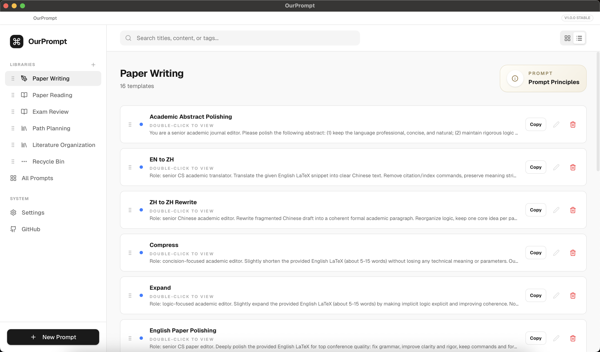
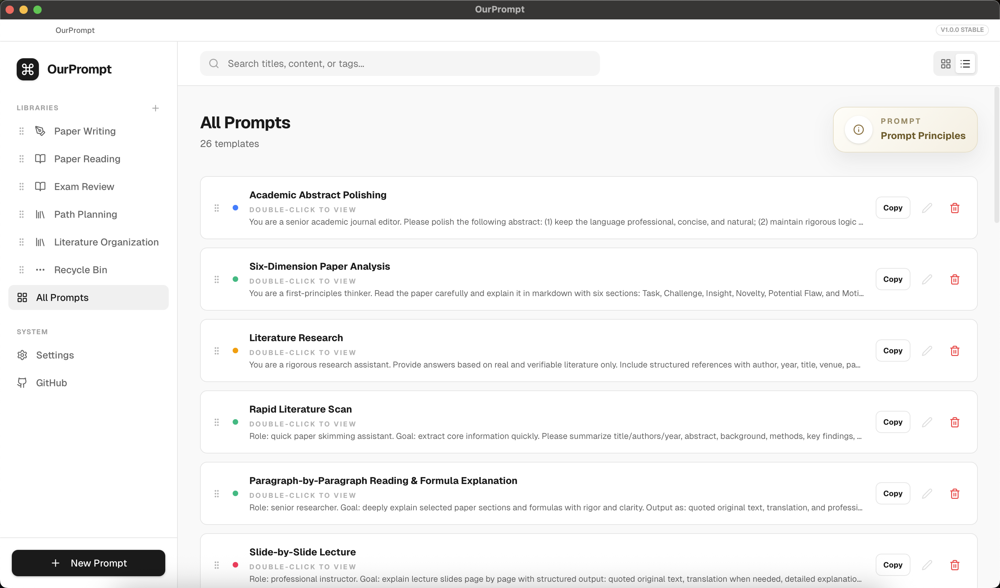

# 🚀 OurPrompt

<div align="right">
  <a href="./README.md">中文</a> · <strong>ENGLISH</strong>
</div>

> **While you are still searching for prompts, others are already shipping results.**  
> **While you are digging old chats for reusable prompts, others are already iterating.**  
> **The gap is not the model itself, but whether you own a reusable prompt system.**  
> **That is why we built OurPrompt.**
>
> **Stop rewriting prompts. Build your prompt system.**

A lightweight cross-platform prompt management tool for researchers and high-frequency LLM users.

### List View (3)



### Grid View (4)



---

## 🧩 High-Quality Prompt Templates

Built in with **26 curated templates**, ready to use.

> 📌 The paper-writing part is based on [Leey21/awesome-ai-research-writing](https://github.com/Leey21/awesome-ai-research-writing)  
> 📌 Other parts are curated and structured from public sources (e.g. Xiaohongshu, Bilibili)

📄 Paper Writing ｜ 📚 Paper Reading ｜ 🧠 Exam Review ｜ 🔍 Literature Organization ｜ 🛠 Path Planning

**Copy → Use → Iterate**

---

## ⚡ Key Features

- Prompt asset management (categories / tags / ordering)
- Global search (title / content / tags)
- Built-in templates (ready out of the box)
- Ultra-light package size (~2MB)
- Minimal interface

---

## 🌐 Language Switching

Open **Settings** in the left sidebar and switch between **Chinese / English**.

When switched to English:

- Built-in category names are shown in English
- Built-in prompt titles and contents are switched to English
- Custom categories and custom prompts stay unchanged

---

## 🚀 Quick Start (Users)

If you only want to use the app (no development), download the proper package from GitHub Releases:

- Windows: `.exe`
- macOS: `.dmg`
- Linux: `.AppImage`

### Windows

Run `OurPrompt-v1.0.2-windows-x64-setup.exe`.

### macOS

Install `OurPrompt-v1.0.2-macos-universal.dmg`, then run:

```bash
xcode-select --install
sudo codesign --force --deep --sign - /Applications/OurPrompt.app
xattr -cr /Applications/OurPrompt.app
```

### Linux

```bash
chmod +x OurPrompt-v1.0.2-linux-x64.AppImage
./OurPrompt-v1.0.2  -linux-x64.AppImage
```

---

## 👨‍💻 Quick Start (Developers)

```bash
npm install
npm run desktop:dev
```

---

## 🤝 Contributing Built-in Prompts / Categories

Fork the repo, then follow the table:

| Type | File | Add Into | Required Fields | Suggested Branch |
|---|---|---|---|---|
| Built-in Prompt | `src/lib/constants.ts` | `DEFAULT_PROMPTS` | `id`, `title`, `content`, `category`, `tags`, `isDefault`, `createdAt`, `updatedAt` | `feat/add-prompt` |
| Built-in Category | `src/lib/constants.ts` | `DEFAULT_CATEGORIES` | `id`, `name`, `icon`, `color` | `feat/add-builtin-category` |

Common commit flow:

```bash
git checkout -b <your-branch>
git commit -m "feat: add builtin xxx"
git push origin <your-branch>
```

Then click **Create Pull Request**.

---

## ⭐ Vision

> **Turn prompts into a reusable system.**

---

## ⭐ Support

If this project helps you, a Star is appreciated.

---

Long live open source  
Praise the sun


