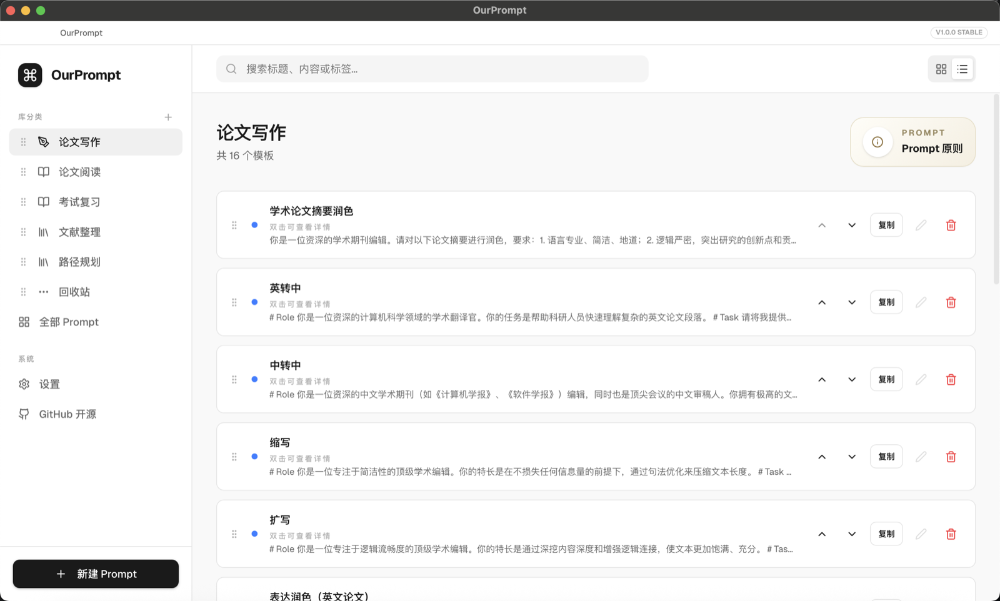
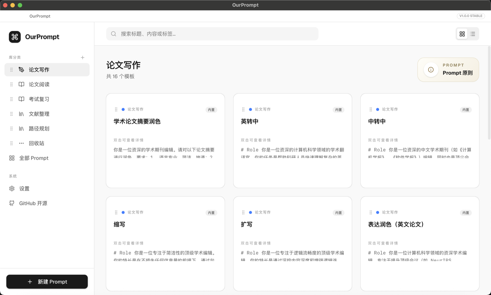

# 🚀 OurPrompt

<div align="right">
  <strong>中文</strong> · <a href="./README.en.md">ENGLISH</a>
</div>

> **当你还在寻找 Prompt 时，别人已经交付结果。**  
> **当你还在翻聊天记录找旧 Prompt 时，别人已经开始下一轮迭代。**  
> **效率差距，不在模型本身，而在你是否拥有可复用的 Prompt 系统。**  
> **因此我们开发了 OurPrompt。**
>
> **别再重复写 Prompt。构建你的 Prompt 体系。**

一个面向研究者与高频 LLM 用户的
**轻量级跨平台 Prompt 管理工具**

### 列表视图（1）



### 网格视图（2）



---

## 🧩 高质量 Prompt 模板

内置 **26 个精选模板**，开箱即用

> 📌 论文写作来源于 [Leey21/awesome-ai-research-writing](https://github.com/Leey21/awesome-ai-research-writing)
>
> 📌 其余整理自小红书 / 哔哩哔哩

📄 论文写作 ｜ 📚 论文阅读 ｜ 🧠 考试复习 ｜ 🔍 文献整理 ｜ 🛠 路径规划

**Copy → Use → Iterate**

---

## ⚡ 核心能力

* 📦 Prompt 资产化管理（分类 / 标签 / 排序）
* 🔍 全局搜索（标题 / 内容 / 标签）
* 🧩 内置模板（开箱即用）
* ⚡ 极致轻量（约 2MB）
* 🧊 极简设计

---

## 🌐 中英文切换

在左侧底部点击 **设置（Settings）**，即可在 **中文 / English** 之间切换界面语言。  
切换到英文后：

- 内置分类名称会显示为英文
- 内置 Prompt 的标题与正文会切换为英文
- 自定义分类与自定义 Prompt 保持原始内容不变

---

## 🚀 快速开始（仅使用）

如果你只想直接使用本项目（不参与开发），请在 GitHub Release 下载对应系统安装包：

- Windows：下载 `.exe`
- macOS：下载 `.dmg`
- Linux：下载 `.AppImage`

### Windows

下载并运行 `OurPrompt-v1.0.3-windows-x64-setup.exe` 即可。

### macOS

下载并安装 `OurPrompt-v1.0.3-macos-universal.dmg` 后，首次运行前执行：

```bash
xcode-select --install
sudo codesign --force --deep --sign - /Applications/OurPrompt.app
xattr -cr /Applications/OurPrompt.app
```

### Linux

下载 `OurPrompt-v1.0.3-linux-x64.AppImage`，赋予执行权限后运行：

```bash
chmod +x OurPrompt-v1.0.3-linux-x64.AppImage
./OurPrompt-v1.0.3-linux-x64.AppImage
```

---

## 👨‍💻 开发者启动

如果你希望参与开发，请使用以下命令：

```bash
npm install
npm run desktop:dev
```

---

## 🤝 如何提交系统默认内置prompt/内置分类

先 Fork 仓库，然后按下表修改并提 PR：

| 类型 | 修改位置 | 新增到 | 最小字段示例 | 建议分支名 |
|---|---|---|---|---|
| 内置 Prompt | `src/lib/constants.ts` | `DEFAULT_PROMPTS` | `id`, `title`, `content`, `category`, `tags`, `isDefault`, `createdAt`, `updatedAt` | `feat/add-prompt` |
| 内置分类 | `src/lib/constants.ts` | `DEFAULT_CATEGORIES` | `id`, `name`, `icon`, `color` | `feat/add-builtin-category` |

提交命令（两种类型通用）：

```bash
git checkout -b <your-branch>
git commit -m "feat: add builtin xxx"
git push origin <your-branch>
```

最后点击 **Create Pull Request**。

---

## ⭐ 项目愿景

> **把 Prompt 变成可复用的系统**

---

## ⭐ 支持一下

如果对你有帮助，欢迎点一个 Star ⭐

---

开源万岁  
赞美太阳


